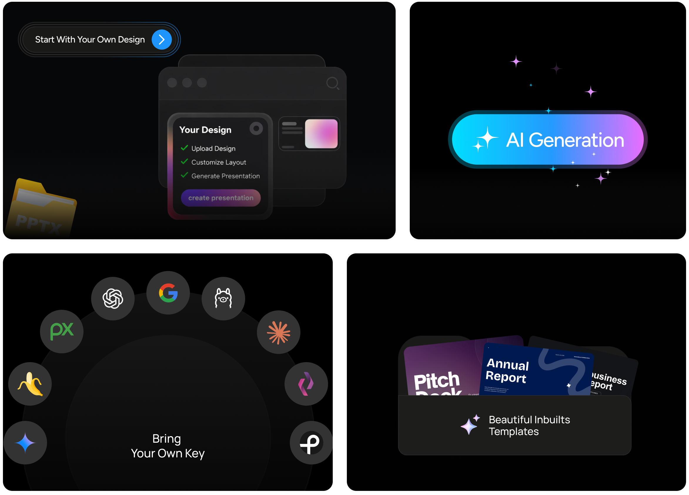
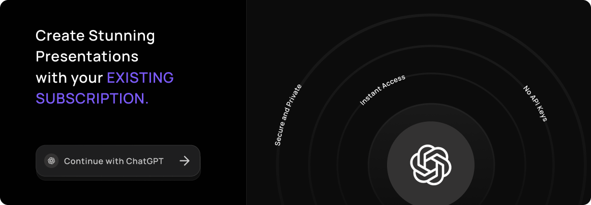
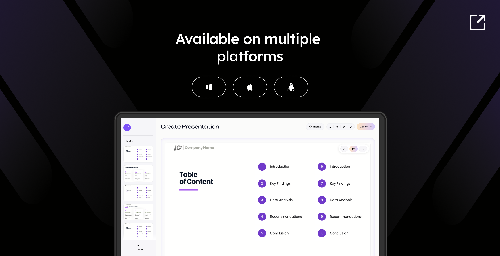

---
## 🇰🇷 추가 기능 (indesign-presenton)

이 저장소는 [Presenton](https://github.com/presenton/presenton)을 기반으로, **InDesign 원본 데이터로부터 슬라이드 아웃라인을 만들어 내는 워크플로우**와 **한국어 UI**를 추가한 포크입니다. 그 외 기능·실행 방법은 아래 원본 문서를 그대로 따릅니다.

### 1. InDesign JSON → 아웃라인 추출·정제

InDesign(HWPX) export JSON을 업로드하면, LLM이 **구조적으로 슬라이드 아웃라인을 추출**하고, 채팅으로 반복 정제한 뒤, 확정하면 **기존 생성 파이프라인**으로 그대로 이어집니다.

- **업로드 라우팅**: `.json` 파일을 올리면 텍스트 추출(decompose) 대신 전용 추출 화면(`/outline-extract`)으로 이동합니다.
- **구조적 추출**: `semantic-blocks`(`version: "sbd-*"`) 포맷을 인식해 좌표·bbox 같은 비텍스트 메타데이터를 제거하고, 문서 구조만 LLM에 전달합니다(대용량 문서도 잘림 없이 처리, 약 98% 토큰 절감).
- **채팅형 정제**: "슬라이드를 8개로 줄여줘", "3번 슬라이드를 둘로 나눠줘" 같은 지시로 아웃라인을 반복 수정합니다. 정제 초안은 `presentation.outlines`에 매 턴 저장됩니다.
- **기존 파이프라인 연결**: 확정된 아웃라인은 기존 `/presentation/prepare`로 전달되어 구조 생성·슬라이드 생성·내보내기로 이어집니다(파이프라인 로직 재사용).

### 2. 재사용 프리셋 (다른 단원에 동일 규칙 적용)

한 문서에서 정제한 변환 규칙을 **프리셋으로 저장**해 다른 문서에 그대로 적용할 수 있습니다.

- 정제 대화를 LLM이 **재사용 가능한 규칙(내용 무관, 구조·양식 규칙)으로 자동 요약**해 저장합니다.
- 새 문서 업로드 시 프리셋을 선택하면, **첫 추출부터 동일한 규칙**(예: 슬라이드 수, 제목 양식)이 적용됩니다.
- 저장소는 기존 `KeyValue` 테이블을 재사용하며 별도 스키마 변경이 없습니다.

**추가 API** (`/api/v1/ppt/outline-refine`)

| 메서드 | 경로 | 설명 |
|--------|------|------|
| POST | `/message` | 첫 호출은 추출, 이후 호출은 편집 지시 적용 (`preset_id`로 프리셋 적용 가능) |
| GET | `/presets` | 저장된 프리셋 목록 |
| POST | `/presets` | 프리셋 저장 (`rules` 생략 시 대화에서 자동 요약) |
| DELETE | `/presets/{id}` | 프리셋 삭제 |

### 3. 한국어 UI

메뉴·내비게이션과 주요 안내 문구(헤더, 사이드바, 설정, 온보딩, 대시보드, 업로드, 템플릿, 생성 버튼 등)를 한국어로 제공합니다.

### 로컬 네이티브 실행 (개발용)

Docker 없이 백엔드/프론트엔드를 직접 띄우는 방법입니다. (Python 3.11 필요)

```bash
# 백엔드 (FastAPI, :8000)
cd servers/fastapi
uv sync
APP_DATA_DIRECTORY=$PWD/../../app_data \
USER_CONFIG_PATH=$PWD/../../app_data/userConfig.json \
MIGRATE_DATABASE_ON_STARTUP=true DISABLE_AUTH=true CAN_CHANGE_KEYS=true \
LLM=openai \
uv run python server.py --port 8000

# 프론트엔드 (Next.js, :3000)
cd servers/nextjs
npm install
FAST_API_INTERNAL_URL=http://127.0.0.1:8000 \
USER_CONFIG_PATH=$PWD/../../app_data/userConfig.json \
DISABLE_AUTH=true npm run dev
```

- LLM 키는 `app_data/userConfig.json`에 넣거나 웹 UI 설정 화면에서 입력합니다. 예: `{ "LLM": "openai", "OPENAI_API_KEY": "sk-...", "OPENAI_MODEL": "gpt-4.1" }`
- nginx 없이 실행하기 위해 `next.config.mjs`에 `/api/v1`·`/app_data`·`/static` rewrite가 추가되어 있습니다.

> ℹ️ 이 포크의 추가 기능은 OpenAI 등 텍스트 LLM 키만 있으면 동작하며, 이미지 생성은 꺼도(placeholder로 대체) 추출·정제·생성이 정상 동작합니다.

---

### ✨ Why Presenton

No SaaS lock-in · No forced subscriptions · Full control over models and data

What makes Presenton different?

- Use Fully **self-hosted** in Web through [Docker Package](https://docs.presenton.ai/v3/get-started/quickstart)
- Or Download [Desktop App](https://presenton.ai/download) (Mac, Windows & Linux)
- Works with OpenAI, Gemini, Vertex AI, Azure OpenAI, Amazon Bedrock, Fireworks, Together AI, Anthropic, LM Studio, Ollama, or custom models
- Comes with AI Presentation Generation API
- Fully open-source (Apache 2.0)
- Works with your own design/templates
- **Fully editable PPTX export**

> [!TIP]
> **Star us!** A ⭐ shows your support and encourages us to keep building! 😇

<p align="center">
  
</p>

#

### 🎛 Features

<p align="center">
  
</p>

<p align="center">
  
</p>

#

### 💻 Presenton Desktop

Create AI-powered presentations using your own model provider (BYOK) or run everything locally on your own machine for full control and data privacy.

<p align="center">
  <a href="https://presenton.ai/download">
    
  </a>
</p>

**Available Platforms**

<table>
<tr>
<th align="left">Platform</th>
<th align="left">Architecture</th>
<th align="left">Package</th>
<th align="left">Download</th>
</tr>

<tr>
<td><b>macOS</b></td>
<td>Apple Silicon / Intel</td>
<td><code>.dmg</code></td>
<td><a href="https://presenton.ai/download">Download ↗</a></td>
</tr>

<tr>
<td><b>Windows</b></td>
<td>x64</td>
<td><code>.exe</code></td>
<td><a href="https://presenton.ai/download">Download ↗</a></td>
</tr>

<tr>
<td><b>Linux</b></td>
<td>x64</td>
<td> <code>.deb</code></td>
<td><a href="https://presenton.ai/download">Download ↗</a></td>
</tr>

</table>


**Deploy to Cloud Providers**

<div style="display:flex; gap:12px; align-items:center;">
  <a href="https://railway.com/deploy/presenton-ai-presentations">
    
  </a>
  <a href="https://cloud.digitalocean.com/apps/new?repo=https://github.com/presenton/presenton/tree/main">
    
  </a>
</div>

#

Presenton gives you complete control over your AI presentation workflow. Choose your models, customize your experience, and keep your data private.

- Custom Templates & Themes — Create unlimited presentation designs with HTML and Tailwind CSS
- AI Template Generation — Create presentation templates from existing Powerpoint documents.
- Flexible Generation — Build presentations from prompts or uploaded documents
- Export Ready — Save as PowerPoint (PPTX) and PDF with professional formatting
- Built-In MCP Server — Generate presentations over Model Context Protocol
- Bring Your Own Key — Use your own API keys for OpenAI, Google Gemini, Vertex AI, Azure OpenAI, Anthropic Claude, or any compatible provider. Only pay for what you use, no hidden fees or subscriptions.
- Ollama Integration — Run open-source models locally with full privacy
- OpenAI API Compatible — Connect to any OpenAI-compatible endpoint with your own models
- Multi-Provider Support — Mix and match text and image generation providers
- Versatile Image Generation — Choose from DALL-E 3, Gemini Flash, Pexels, or Pixabay
- Rich Media Support — Icons, charts, and custom graphics for professional presentations
- Runs Locally — All processing happens on your device, no cloud dependencies
- API Deployment — Host as your own API service for your team
- Fully Open-Source — Apache 2.0 licensed, inspect, modify, and contribute
- Docker Ready — One-command deployment with GPU support for local models
- Electron Desktop App — Run Presenton as a native desktop application on Windows, macOS, and Linux (no browser required)
- Sign in with ChatGPT — Use your free or paid ChatGPT account to sign in and start creating presentations instantly — no separate API key required
